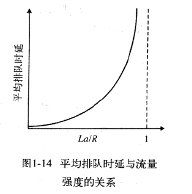
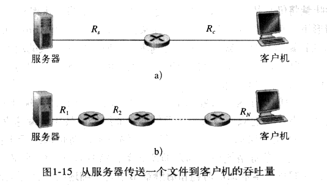
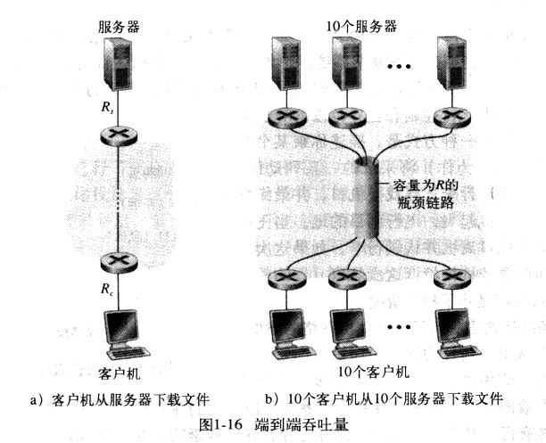

### 分组交换网中的时延、丢包和吞吐量

吞吐量：每秒能够传输的数据量。

分组从一台主机（源）出发，通过一系列路由器传输，在另一台主机（目的地）结束它的历程。当分组从一个节点（主机或路由器）沿着这条路径到后继节点（主机或路由器）时，该分组在沿途的每个节点都经受了几种不同类型的时延。这些时延中最为重要的是__节点处理时延__(nodal processing delay)、__排队时延__(queuing delay)、__传输时延__(transmission delay)和__传播时延__(propagation delay)，这些时延总体加起来是__节点总时延__(total nodal delay)。

__处理时延__：检查分组首部和决定将该分组导向何处所需要的时间是__处理时延__的一部分。处理时延也包括其他因素，如检查比特级差错所需要的时间。

__排队时延__：在队列中，当分组在链路上等待传输时，它经受__排队时延__。一个特定分组的排队时延将取决于先期到达的、正在排队等待向链路传输的分组的数量。如果队列是空的，并且当前没有其他分组在传输，则该分组的排队时延为0。另一方面，如果流量很大，并且许多其他分组也在等待传输，该排队时延将很大。到达组的分组数量是到达该队列的流量的强度和性质的函数。

__传输时延__：假定分组以先到先服务的方式传输——这在分组交换网中是常见方式，仅当所有已经到达的分组被传输后，才能传输我们的分组。用L比特表示分组的长度，用Rbps表示从路由器A到达路由器B的链路传输速率。例如，对于一条10Mbps的以太网链路，速率R= 10Mbps。__传输时延__(又称为存储转发时延)是L/R。这是将所有分组的比特推（传输）向链路所需要的时间。

__传播时延__：一旦一个比特被推向链路，该比特需要向路由器B传播。从该链路的起点到路由器B传播所需要的时间是__传播时延__。该比特以该链路的传播速率传播。该传播速率取决于该链路的物理媒体（即光纤、双绞铜线等），其速率范围在2\*10^8~3\*10^8m/s，这等于或略小于光速。传播时延等于两台路由器之间的距离除以传播速率，即传播时延是d/s，其中d是路由器A和路由器B之间的距离，s是该链路的传播速率。一旦该分组的最后一个比特传播到节点B，该比特及前面的所有比特都被存储于路由器B。整个过程将随着路由器B执行转发而持续下去。在广域网中，传播时延在毫秒的量级。

__传输时延和传播时延的比较__：传输时延是路由器将分组推出所需要的事件，它是分组长度和链路传输速率的函数，而与两台路由器之间的距离无关。传播时延是一个比特从一台路由器向另一台路由器传播所需要的时间，它是两台路由器之间距离的函数，但与分组的长度或链路的传输速率无关。

__排队时延和丢包__：流量到达该队列的速率、链路的传输速率和到达流量的性质也就是流量是周期性还是以突发形式到达，在很大程度上决定了排队时延什么时候大，什么时候又不大。用a表示分组到达队列的平均速率（a的单位是每秒分组，每秒到达多少分组，pkt/s）。用R表示传输速率（bps）。假定所有分组都由L比特组成，则比特到达队列的平均速率是La bps。最后假定队列非常大，能容纳无限数量的比特。比率La/R 被称为流量强度。如果La/R > 1，则比特到达队列的平均速率超过从该队列传输出去的速率，这种情况下，队列的增加将趋于无界。因此，流量工程中，必须要遵守的一条准则是：__设计系统时流量强度不能大于1。__

​	当La<=1时，此时到达流量的性质影响排队时延。如果分组周期性到达，即每L/R s到达一个分组，则每个分组将到达一个空队列中，因此不会有排队时延。另一方面，如果分组以突发形式到达而不是周期性到达，则可能有很大的平均时延。例如，假定每L/R s同时到达N个分组，则传输的第一个分组没有排队时延；传输的第二个分组就有L/R s的排队时延；更为一般的，第n个分组就有(n-1) L/Rs的排队时延。

​	如果流量强度接近于0，则几乎没有分组到达并且到达间隔很大，那么到达的分组将不可能在队列中发现别的分组。因此，平均排队时延将接近于0。另一方面，当流量强度接近于1时，将存在到达率超过传输能力的时间间隔（由于到达的突发性），从而将形成队列。随着流量强度接近于1，平均排队长度变得越来越长。

随着流量强度接近于1，平均排队时延迅速增加。流量强度的少量增加将导致时延的大量增加。

__丢包__：因为排队容量有限，所以流量强度接近1时排队时延也不会趋于无穷大。相反，到达的分组将发现一个满的队列。由于没有地方存储这个分组，路由器将__丢弃__(drop)该分组，即该分组会__丢失__(lost)。以丢失分组看起来已经传输到网络核心，但它不会出现在目的地。丢失分组的数量随着流量强度的增加而增加。因此，分组丢失的概率和时延都应该用来度量节点的性能。

__吞吐量__：考虑从主机A到主机B传输一个大文件。任何瞬间的__瞬时吞吐量__是主机B接收该文件的速率(bps)。如果文件有F比特组成，而主机B接收到所有F比特用了T秒，则文件传送的平均吞吐量是F/T bps。

对于上图a中简单的两链路网路，其吞吐量是min{Rc, Rs}，也就是说，是__瓶颈链路__的传输速率。对于图b而言，服务器和客户机之间有N条链路，其从服务器到好、客户机传输文件的吞吐量是min{R1, R2, ....,Rn}，仍然是沿着服务器和客户机之间路径的瓶颈链路的速率。

在上图a中，假设网络核心链路速率恨到，远超过Rs和Rc，所以，比特从源向目的地流动速率还是Rs和Rc中的较小者，即min{Rs, Rc}。对于图b中情况而言，公共链路速率R恨到的情况下，比如比Rs和Rc大100倍，则每个下载的吞吐量仍然是min{Rs, Rc}。如果R与Rs和Rc量级相同，具体来说，假定Rs=2Mbps, Rc=1Mbps, R = 5Mbps, 并且公共链路对10个下载平分其传输速率。这是，每个下载的瓶颈不再是接入网了，而是核心中的公共链路了，公共链路仅能为每个下载提供500kbps的吞吐量。

1-16a中的例子说明吞吐量取决于数据流过的链路的传输速率。1-16b中的例子说明吞吐量不仅取决于沿着路径的传输速率，而且取决于干扰流量。特别的是，如果许多数据流都通过一条链路流动，那么及时这条链路具有高传输速率，也可能成为文件传输的瓶颈链路。

例：考虑两台主机A和主机B由一条带宽为R bps、长度为M米的链路互连，信号传播速率为V m/s。假设主机A从t=0时刻开始向主机B发送分组，分组长度为L比特。试求：

1) 传播延迟（时延）dp；

2) 传输延迟dt；

3) 若忽略结点处理延迟和排队延迟，则端到端延迟de是多少？

4) 若dp>dt，则t=dt时刻，分组的第一个比特在哪里？

5) 若V=250000km/s，L=512比特，R=100 Mbps，则使带宽时延积刚好为一个分组长度（即512比特）的链路长度M是多少？

**(注：1k=10^3,1M=10^6)**

解：1)：传播时延 dp = 信道长度(m) / 电磁波在信道上的传播速率(m/s) = M/V

​	2)：传输延迟 dt = 数据帧长度(b) / 信道宽带(b/s) = L / R

​	3)：总延迟 de = 传播时延 +传输时延　＝　M/V + L / R

​	4)：dp > dt意味着最早发送的比特还没到达目的地之前，数据分组的下一个比特已经发送出来了，所以分组的第一个比特在距离主机V * dt 米的链路上。

​	5)：时延带宽积 = 传播时延 * 带宽 = M / V * R = 512，解得M= 1280米。

时延带宽积：如果以最大的宽带发送数据，然后第一个比特到达目的地的时候，节点发送的比特数量，而这些比特数量此时都在信道里传输，也就是某时链路上可容纳的最大的比特数。