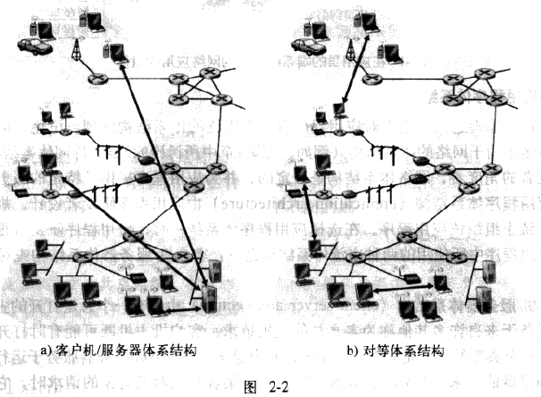
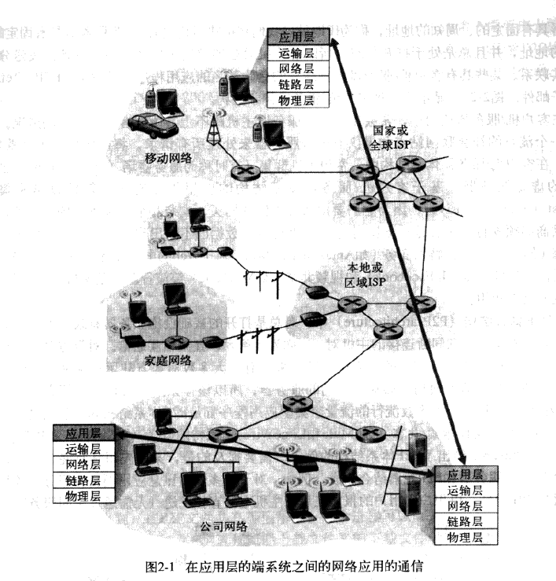
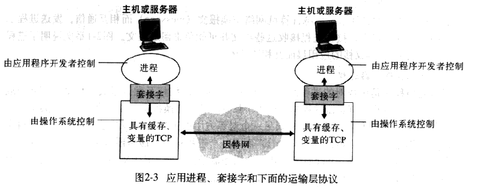

### 应用层协议原理

​	研发	网络应用程序的核心是写出能够运行在不同的端系统和通过网络彼此通信的程序。

​	网络核心设备具体在网络层及下面层次起作用，所以，研发新的网络应用程序时，需要编写将在多台端系统上运行的软件，而不需要写在网络核心设备上运行的软件。

​	应用程序的体系结构不同于网络的体系结构。从应用程序研发者角度看，网络体系结构固定，并为应用程序提供了特定的服务集合。另一方面，__应用程序体系结构__由应用程序研发者设计，规定了如何在各种端系统上组织该应用程序。

​	现代网络中应用程序主流的体系结构有两种：客户机/服务器体系结构、对等(P2P)体系结构。

__客户机/服务器体系结构__：

* 用一个总是打开的主机成为服务器，它服务于许多其他称为客户机的主机请求。
* 客户机既可能有时打开，也可能总是打开。
* 客户机之间不直接相互通信。
* 服务器具有固定的、周知的地址，称为IP地址。

  ​常见的著名的具有客户机/服务器体系结构的应用程序有：Web、FTP、Telnet、电子邮件等。在客户机/服务器体系结构中，常用主机群集（也叫服务器场）创建强大的虚拟服务器，以处理其所有客户机的请求。因此，客户机/服务器体系结构的应用服务通常是__基础设施密集的__。

__P2P体系结构__：

* 对总是打开的基础设施有最小的依赖。

* 任意间断连接的主机对---称为对等方，直接相互通信，不通过专门的服务器。

* 具有自扩展性，每个对等方都由请求文件产生负载，但每个对等方向其他对等方分发文件也为系统增加了服务能力。

  ​

  大多数流行的流量密集型应用程序都是P2P体系结构，包括文件分发、文件搜索/共享、因特网电话和IPTV等。

  某些应用具有混合的体系结构，由客户机/服务器和P2P元素结合而成。

  

#### 进程通信

​	在操作系统术语中，进行通信的实际上是__进程__(process)而不是程序。相同端系统中的进程使用进程间通信机制相互通信，进程间通信规则由端系统上的操作系统确定。我们关注不同端系统上的进程间通信。

​	不同端系统上的进程通过跨越计算机网络交换__报文__(message)而相互通信。发送进程创建并向网络中发送报文，接收进程接收这些报文并可能负责回送报文。下图举例说明了进程是如何通过5层协议栈的应用层而互相通信的。

##### 客户机和服务器进程

​	__网络应用程序由成对的进程组成__，进程间通过网络相互发送报文。在给定的一对进程之间的通信会话中，发起通信（即在该会话开始时与其他进程联系）的进程被标示为__客户机__，在会话开始时等待联系的进程是__服务器__。

​	在Web中，浏览器是客户机，Web服务器进程是服务器。在P2P文件共享中，当对等方A请求对等方B发送一个特定的文件时，这个特定的通信会话中的对等方A是客户机，而对等方B是服务器。

##### 进程与计算机网络之间的接口

​	多数应用程序由通信进程对组成，每队中的两个进程互相发送报文。从一个程序向另一个程序发送的报文必须通过下面的网络。进程通过一个称为__套接字__(socket)的软件接口在网络上发送和接收报文。

​	如下图所示，套接字是同一台主机内应用层与运输层之间的接口。由于套接字是在网络上建立网络应用程序的可编程接口，因此也将套接字称为应用程序和网络之间的__应用程序编程接口__。

