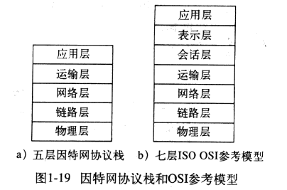
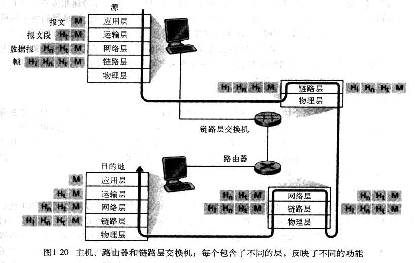

### 协议层析和服务模型

​	协议分层具有概念化和结构化的优点。分层提供了一种结构化方式来讨论系统组件。模块化是的更新系统组件更为容易。

​	分层的潜在缺点是某层可能重复其较低层的功能，还有就是某层的功能可能需要仅在其他某层才出现的信息（如时间戳），这违反了层次分离的目标。

​	各层的所有协议被称为__协议栈__(protocol stack)。因特网的协议栈由5个层次组成：物理层、链路层、网络层、运输层和应用层。

__应用层__：应用层是网络应用程序及其应用层协议存留的地方。常见的应用层协议包括，如HTTP(为Web文档提供了请求和传送)、SMTP(提供了电子邮件报文的传输)和FTP(提供了两个端系统之间的文件传送)。

​	应用层协议分布在多个端系统上，一个端系统中的应用程序使用协议与另一个端系统中的应用程序交换分组。位于应用层的信息分组成为__报文__。

__运输层__：运输层提供了在应用程序端点之间传送应用层报文的服务。因特网中，有两个运输层协议，TCP和UDP，利用其中任何一个都可以传输应用层报文。运输层分组成为__报文段__。

TCP：提供面向连接服务，包括应用层报文想目的地的确保传递和流量控制；将长报文划分为短报文；提供拥塞机制。

UDP：提供无连接服务，不提供可靠性，没有流量控制，也没有拥塞控制。

__网络层__：网络层负责将称为__数据报__的网络层分组从一台主机移动到另一台主机。该层协议有IP协议。该协议定义了数据报中的各个字段以及端系统和路由器如何作用于这些字段。

__链路层__：提供将网络层的分组从一个节点移动到路径上的下一个节点的服务。在每个节点，网络层将数据报下传给链路层，链路层沿着路径将数据报传递给下一个节点。在该下一个节点，链路层将数据报上传给网络层。

​	链路层提供的服务取决于应用于该链路的特定链路层协议。链路层例子包括以太网、WiFi和点对点协议(PPP)。网络层将接收来自每个不同的链路层协议的不同服务。链路层分组成为__帧__。

__物理层__：链路层任务是将整个帧从一个网络元素移动到邻近的网络元素，物理层的任务是将该帧中的一个一个比特从一个节点移动到下一个节点。物理层中的协议仍然是链路相关的，并且进一步与链路（如双绞铜线、单模光纤）的实际传输媒体有关。

__ISO模型__：开放系统互连(OSI)模型。有7层：应用层、表示层、会话层、运输层、网络层、链路层、物理层。其中与因特网协议栈的五层名字相同的层，其功能也基本相同。另外多出来的两层，即表示层和会话层。表示层的作用是是通信的应用程序能够解释交换数据的含义，它所提供的服务包括数据压缩、数据加密以及数据描述。会话层提供了数据交换的定界和同步功能，包括建立检查点和恢复方案的方法。

在发送主机，__应用层报文__被传输给运输层。在最简单情况下，运输层收取报文并附上附加信息（即运输层首部信息，Ht），该首部信息将被接收端的运输层使用。应用层报文和运输层首部信息共同构成了__运输层报文段__。运输层报文段因此封装了应用层报文。附加的信息可能包括，允许接收端运输层向上向适当的应用程序交付报文的信息；差错检测比特信息，利用该信息接收方能判断报文中的比特是否在途中已被改变。运输层则向网络层传递该报文段，网络层增加了如源和目的端系统地址等网络层首部信息，形成了__网络层数据报__。该数据报接下来被传递给链路层，链路层也增加自己的链路层首部信息并创建了__链路层帧__。综上，在每一层，分组有两种类型的字段：首部字段和__有效载荷字段__。有效载荷字段通常来自上一层的分组。