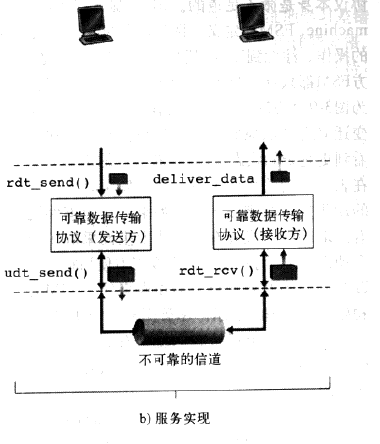
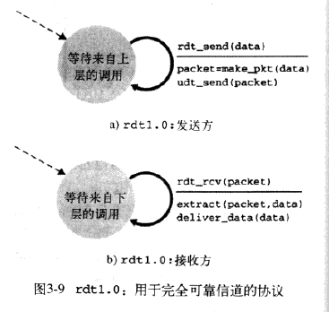
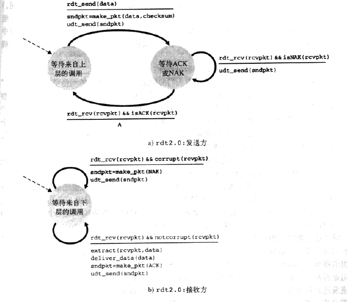

* TCP向上层实体提供的服务抽象是：数据可以通过一条可靠的信道进行传输。借助于可靠信道，传输数据比特就不会受到损坏（由0变为1，或者相反）或丢失，而且所有数据都是按照其发送顺序进行交付。
* 实现上面所说的服务抽象是__可靠数据传输协议__的责任。
* 可靠数据传输协议的下层协议也许是不可靠的。例如，TCP是在不可靠的（IP）端到端网络层之上实现的可靠数据传输协议。
* 更一般的情况，两个可靠通信端点的下层可能是由一条物理链路组成或是由一个全球互联网络组成。然而，就我们的目的而言，我们可将较低层直接视为不可靠的点对点信道。
* 讨论的前提假设：分组将以它们发送的次序进行交付，某些分组可能会丢失。也就是说，底层信道不会对分组重排序

* 上图说明了用于数据传输协议的接口。通过调用rdt_send()函数，可以调用数据传输协议的发送方。它将要发送的数据交付给位于接收方的较高层。（这里rdt表示可靠数据传输协议）。在接收端，当分组从信道的接收端到达时，将调用rdt_rcv()。当rdt协议想要向较高层交付数据时，将通过deliver_data()来完成。
* 除了交换含有待传送的数据的分组之外，rdt的发送端和接收端还需往返交换控制分组。rdt的发送端和接收端都要通过调用udt_send()发送分组给对方（其中udt表示不可靠数据传输）。

#### 经完全可靠信道的可靠数据传输：rdt1.0

* 考虑最简单的情况，即底层信道是完全可靠的。

​	上图显示了rdt1.0发送方和接收方的__有限状态机__(FSM)。注意，发送方和接收方有各自的FSM。上图中，发送方和接收方的FSM都只有一个状态。

​	rdt的发送端只通过rdt_send(data)事件接受来自较高层的数据，产生一个包含该数据的分组（经由make_pkt(data)动作），并将分组发送到信道中。

​	在接收端，rdt通过rdt_rcv(packet)事件从底层信道接收一个分组，从分组中取出数据（经由extract(packet,data)动作），并将数据上传给较高层（通过deliver_data(data)动作）。

​	在上面这个简单的协议中，一个单元数据和一个分组没有差别。而且，所有分组都是从发送方流向接收方；有了完全可靠的信道，接收端就不需要提供任何反馈信息给发送方，因为不必担心出现差错。此外，我们也已经假定了接收方接收数据的速率能够与发送方发送数据的速率一样快，因此，没有必要要求发送方慢一点。

#### 经有比特差错信道的可靠数据传输：rdt2.0

* 底层信道更为实际的模型是分组中的比特可能受损。在分组传输、传播或缓存的过程中，这种比特差错通常会出现在网络的物理部件中。
* __肯定确认与否定确认__：这些控制报文使得接收方可以让发送方知道哪些内容被正确接收，哪些内容接收有误并因此需要重复。
* 在计算机网络中，基于这样重传机制的可靠数据传输协议称为__自动重传请求__。
* 基本上，ARQ协议中还需要另外三种协议功能来处理存在比特差错的情况：
  * 差错检测：接收方要有检查机制检查何时出现比特差错
  * 接收方反馈：接收方要向发送方提供反馈信息。rdt2.0协议将从接收方向发送方回送ACK与NAK分组。理论上，这些分组只需要一个比特长：如用0表示NAK，用1表示ACK。
  * 重传：接收方收到有差错的分组时，发送方将重传该分组文。

​	上图为rdt2.0的FSM，改数据传输协议采用了差错检测、肯定确认与否定确认。

​	rdt2.0发送端有两个状态。

