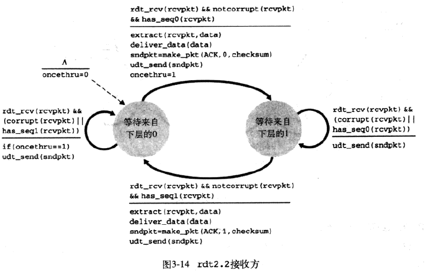

* TCP向上层实体提供的服务抽象是：数据可以通过一条可靠的信道进行传输。借助于可靠信道，传输数据比特就不会受到损坏（由0变为1，或者相反）或丢失，而且所有数据都是按照其发送顺序进行交付。
* 实现上面所说的服务抽象是__可靠数据传输协议__的责任。
* 可靠数据传输协议的下层协议也许是不可靠的。例如，TCP是在不可靠的（IP）端到端网络层之上实现的可靠数据传输协议。
* 更一般的情况，两个可靠通信端点的下层可能是由一条物理链路组成或是由一个全球互联网络组成。然而，就我们的目的而言，我们可将较低层直接视为不可靠的点对点信道。
* 讨论的前提假设：分组将以它们发送的次序进行交付，某些分组可能会丢失。也就是说，底层信道不会对分组重排序

* 上图说明了用于数据传输协议的接口。通过调用rdt_send()函数，可以调用数据传输协议的发送方。它将要发送的数据交付给位于接收方的较高层。（这里rdt表示可靠数据传输协议）。在接收端，当分组从信道的接收端到达时，将调用rdt_rcv()。当rdt协议想要向较高层交付数据时，将通过deliver_data()来完成。
* 除了交换含有待传送的数据的分组之外，rdt的发送端和接收端还需往返交换控制分组。rdt的发送端和接收端都要通过调用udt_send()发送分组给对方（其中udt表示不可靠数据传输）。

#### 经完全可靠信道的可靠数据传输：rdt1.0

* 考虑最简单的情况，即底层信道是完全可靠的。

​	上图显示了rdt1.0发送方和接收方的__有限状态机__(FSM)。注意，发送方和接收方有各自的FSM。上图中，发送方和接收方的FSM都只有一个状态。

​	rdt的发送端只通过rdt_send(data)事件接受来自较高层的数据，产生一个包含该数据的分组（经由make_pkt(data)动作），并将分组发送到信道中。

​	在接收端，rdt通过rdt_rcv(packet)事件从底层信道接收一个分组，从分组中取出数据（经由extract(packet,data)动作），并将数据上传给较高层（通过deliver_data(data)动作）。

​	在上面这个简单的协议中，一个单元数据和一个分组没有差别。而且，所有分组都是从发送方流向接收方；有了完全可靠的信道，接收端就不需要提供任何反馈信息给发送方，因为不必担心出现差错。此外，我们也已经假定了接收方接收数据的速率能够与发送方发送数据的速率一样快，因此，没有必要要求发送方慢一点。

#### 经有比特差错信道的可靠数据传输：rdt2.0

* 底层信道更为实际的模型是分组中的比特可能受损。在分组传输、传播或缓存的过程中，这种比特差错通常会出现在网络的物理部件中。
* __肯定确认与否定确认__：这些控制报文使得接收方可以让发送方知道哪些内容被正确接收，哪些内容接收有误并因此需要重复。
* 在计算机网络中，基于这样重传机制的可靠数据传输协议称为__自动重传请求__。
* 基本上，ARQ协议中还需要另外三种协议功能来处理存在比特差错的情况：
  * 差错检测：接收方要有检查机制检查何时出现比特差错
  * 接收方反馈：接收方要向发送方提供反馈信息。rdt2.0协议将从接收方向发送方回送ACK与NAK分组。理论上，这些分组只需要一个比特长：如用0表示NAK，用1表示ACK。
  * 重传：接收方收到有差错的分组时，发送方将重传该分组文。

​	上图为rdt2.0的FSM，该数据传输协议采用了差错检测、肯定确认与否定确认。

rdt2.0发送端有两个状态：

 *   在左边的状态中，发送端协议正等待来自上层传下来的数据。当产生rdt_send(data)事件时，发送方将产生一个包含待发送数据的分组（sndpkt），带有检验和，然后经由udt_send(sndpkt)操作发送该分组。
 *   在右边的状态中，发送方协议等待来自接收方的ACK或NAK分组。如果收到一个ACK分组，则发送方协议知道最近发送的分组已被正确接收，因此协议返回到等待来自上层的数据的状态。如果收到一个NAK分组，该协议重传最后一个分组并等待接收方为响应重传分组而回送的ACK和NAK。

__注意__：当发送方处于等待ACK或NAK的状态时，它不能从上层获得更多数据；也就是说，rdt_send()事件此时不可能出现；仅当接收到ACK并离开该状态时才能发生这样的事件。因此，发送方将不会发送一块新数据，除非发送方确信接收方已正确接收当前分组。因此，rdt2.0也因此称为__停等（stop-wait）__协议。

rdt2.0接收方的FSM仍然只有一个状态。分组到达时，接收方要么回答一个ACK要么回答一个NAK，这取决于收到的分组是否受损。

* rdt_rcv(rcvpkt)&& corrupt(rcvpkt)：收到一个分组并发现有错误，此时就会发生下面的事件——打包一个NAK分组，并回传，告诉发送方，接收到的分组有错误。
* rdt_rcv(rcvpkt)&&notcorrupt(rcvpkt)：接收到一个分组，并且分组没有受损，此时接收方就会打包一个ACK分组，并回传，告诉发送方，接收到的分组没有差错。

rdt2.0协议有个缺陷，就是没有考虑ACK或者NAK分组受损的可能性，考虑处理受损ACK和NAK时的3中可能性：

* 第一种：发送方对接收到的有差错的ACK或NAK再次发送分组询问接收方发送的是ACK还是NAK，接收方在接收到消息后复述刚才发送的分组。但是如果发送方发送的询问消息差生了差错又会怎样呢？接收方很可能会发送分组询问发送方刚才发送的是什么消息。如果此时，接收方发送的询问分组又受损了......如此看来，询问将没玩没了下去。
* 第二种：增加足够的检验和比特，使发送方不仅可以检测差错，还可以恢复差错。对于会产生差错但是不会丢失分组的信道，这就可以直接解决问题。
* 第三种：当发送方收到含糊不清的ACK或NAK分组时，只需重传当前数据分组即可。然而，这种方法在发送方到接收方的信道中引入了__冗余分组__。冗余分组的根本困难在于接收方不知道它上次所发送的ACK或NAK是否被发送方接收到。因此无法事先知道接收到的分组是新的还是一次重传。

​	解决第三种方法问题的一个简单方法就是在数据分组中添加一新的字段，让发送方对其数据分组编号，即将发送数据分组的__序号__放在该字段。这样，接收方只需要检查序号即可确定收到的分组是否是一次重传。对于接收方，如果接收到的分组序号与最近收到的分组序号相同，则说明发送方在重传前一个发送分组；如果序号变化了，则说明是一个新的分组。因为目前我们假定信道不丢失分组，ACK和NAK分组本身不需要指明它们要确认的分组序号。发送方知道所接收到的ACK和NAK分组是为响应其最近发送的数据分组而生成的。

上图为rdt2.1的发送方和接收方的FSM描述。rdt2.1的发送方和接收方FSM的状态数都是以前的两倍。这是因为协议状态必须反映出目前正发送的分组或希望接收的分组的序号是0还是1。

当接收到失序的分组时，接收方对所接收的分组发送一个肯定确认。如果收到受损的分组，则接收方将发送一个否定确认。

如果不发送NAK，而是对上次正确接收的分组发送一个ACK，我们也能实现与NAK一样的效果。发送方接收到对同一个分组的两个ACK（即接收冗余ACK）后，就知道接收方没有正确接收跟在被确认两次的分组后面的分组。由此产生rdt2.2。

rdt2.2是在有比特差错信道上实现的一个无NAK的可靠数据传输协议。rdt2.1和rdt2.2差别在于，接收方此时必须包括由一个ACK报文所确认的分组序号，发送方必须检查接收到的ACK报文中被确认的分组序号。

#### 

