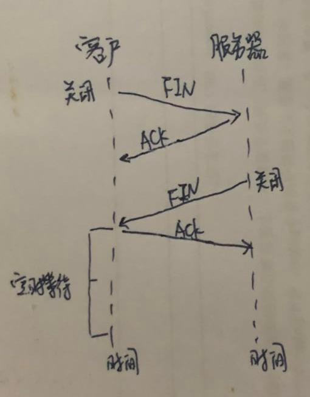

#### 四次挥手

参与一条tcp连接的两个进程中的任何一个都能终止该连接。假设客户进程先发出一只终止连接的命令:

* 首先客户tcp会向服务器进程发送一个特殊的tcp报文段。这个报文段的首都中的一个标志位即FIN比特被置为1
* 当服务器接收到该报文段后，就向发送方回送一个确认报文段
* 然后，服务器发送它自己的终止报文段，其FIN比特被置为1
* 最后，该客户对这个服务器的终止报文段进行确认

此时，在两台主机上用户该连接的所有资源都被释放了。

