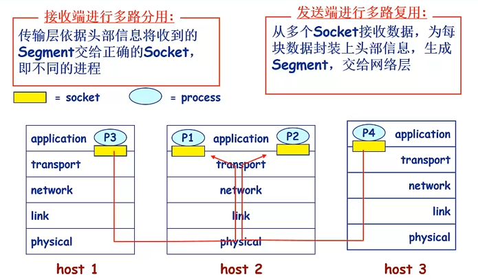
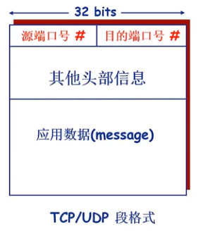
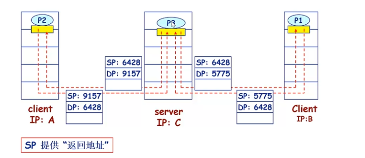
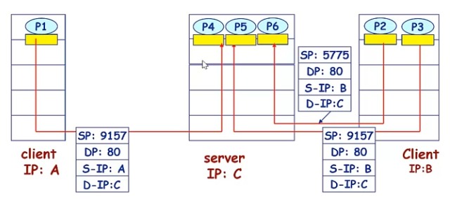
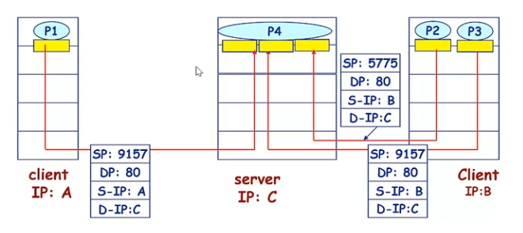

#### 为什么要进行多路复用与分用？

如果某层的一个协议对应直接上层的多个协议/实体，则需要复用/分用。

__接收端进行多路复用__：传输层依据头部信息将收到的Segment交给正确的Socket，即不同的进程。主机2接收到来自主机1和主机3的信息，分别是主机1的P3进程到主机2的P1进程，主机3的P4进程到主机2的P2进程。网络层协议只有一个（即IP协议），对于主机2的运输层来讲，在从网络层接收到报文段之后，其必须要做的一件事情就是将报文段交付给正确的进程，这一动作（或者说功能）就叫多路分用（也叫多路分解）。

__发送端进行多路复用__：从多个Socket接收数据，为每个数据封装上头部信息，生成Segment，交给网络层。

#### 多路分用如何工作？

* 主机接收到IP数据报（datagram）
  * 每个数据报携带源IP地址、目的IP地址。
  * 每个数据报携带一个传输层的段（Segment）（每个传输层的报文段都必须携带源端口号和目的端口号，这一点TCP和UDP是一致的）。
  * 每个段携带源端口号和目的端口号

* 主机收到Segment后，传输层协议提取IP地址和端口号信息，将Segment导向相应的Socket。
  * TCP在收到Segment后会做更多的事情
  * 网络层并不会对Segment中的信息进行处理，Segment对网络层来说是透明的。

#### 无连接的多路分用

* UDP的Socket用二元组标识
  * 目的IP地址，目的端口号
* 主机接收到UDP报文段后
  * 检查报文段中的目的端口号
  * 将UDP报文段导向绑定在该端口号的Socket中
* 来自不同源IP地址和/或源端口号的IP数据包在目的IP地址和目的端口号相同的情况下将被导向同一个Socket。

#### 面向连接的多路分用

* TCP的Socket用四元组标识
  * 源IP地址
  * 源端口号
  * 目的端口号
* 接收端利用所有的四个值将Segment导向合适的Socket
* 服务器可能同时支持多个TCP Socket
  * 每个Socket用自己的四元组标识
* Web服务器为每个客户端开不同的Socket

主机C和主机B之间有连个TCP连接，这两个连接的区分靠的是源端口号。

TCP协议是一对一的，一个客户机进程对应一个服务器进程

#### 面向连接的分用：多线程Web服务器

​	上图中，服务器只开启了一个进程，进程下又开启了多个线程，真正与客户机进程维持TCP连接的其实是服务器的线程。

​	进程对资源的开销比较大，为了节省开销，在进程内部创建多个线程，然后使用线程来绑定不同的TCP连接，节省资源。