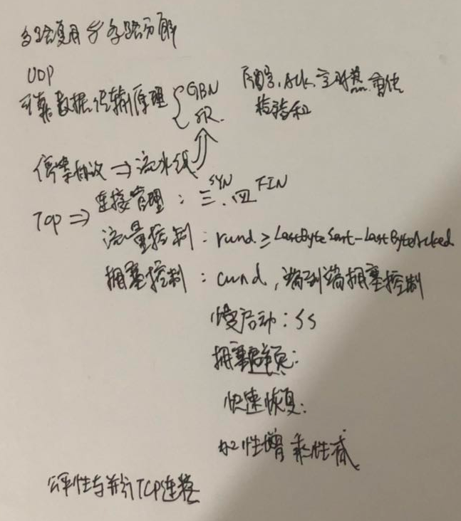

#### 总结

​       运输层协议能够向网络应用程序提供服务，一个极端，运输层协议非常简单，不提供不必要的服务，比如UDP协议；另一个极端，运输层协议能够向应用层程序提供各式各样的保证，例如可靠交付、时延保证和带宽保证。

​       运输层协议能够提供的服务经常受下面网络层协议服务模型的限制。如果网络层协议不能向运输层报文段提供时延或贷款保证，那么运输层协议就不能向进程间发送的报文段提供时延或贷款保证。

​	在链路层、网络层、传输层或应用层协议中都可以提供可靠数据栓送，协议栈中上面4层的任意一层都可以实现确认、定时器、重传以及序号，能够向其上层提供可靠数据传送。

​	TCP协议是面向连接的、可靠的运输层协议，它涉及了连接管理、流量控制、拥塞控制、往返时间估计以及可靠数据传送。

​	拥塞控制对于网络良好运行是必不可少的，没有拥塞控制，网络很容易出现死锁，是的端到端之间很少或没有数据能被传输。TCP的拥塞控制机制-----加性增，乘性减，这种机制也致力于做到每一个通过拥塞链路的TCP连接能平等的共享该链路带宽。TCP连接建立和慢启动会对端到端时延产生严重影响。

​	计算机网络被划分为“网络边缘”和“网络核心”，网络边缘包含了在端系统中发生的所有事情。

